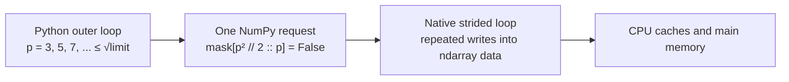

# NumPy Sieve of Eratosthenes

An educational implementation of the Sieve of Eratosthenes that explores why
NumPy can make array-heavy Python code much faster without changing the
algorithm's asymptotic complexity.

The implementation:

- finds every prime up to an inclusive limit
- stores only odd candidates
- moves the large inner marking loops into NumPy slice assignments
- constructs the result without Python-level element loops
- keeps benchmarking separate from the algorithm

This project focuses on learning array processing, memory representation, and
Python performance with NumPy.

## Requirements

- Python 3.12+
- NumPy 2.5+

```bash
python -m pip install -r requirements.txt
```

On Windows with multiple Python versions installed, use `py -3.14` instead.

## Quick start

```python
from eratosthenes import count_primes, eratosthenes

print(eratosthenes(30))
# [ 2  3  5  7 11 13 17 19 23 29]

print(count_primes(1_000_000))
# 78498
```

The limit is inclusive. `eratosthenes(30)` checks values from `0` through `30`.

## API

### `eratosthenes(limit)`

Returns every prime up to `limit` as a one-dimensional NumPy `int64` array.

```python
eratosthenes(10)
# array([2, 3, 5, 7])
```

### `count_primes(limit)`

Returns the number of primes without building the final prime array.

```python
count_primes(10)
# 4
```

`limit` must be a non-negative Python or NumPy integer. Invalid types raise
`TypeError`. Negative values and values beyond the platform index range raise
`ValueError`. A valid but impractically large limit may still raise
`MemoryError`.

## How the sieve works

### 1. Store only odd candidates

Every even number greater than `2` is composite. The mask therefore stores one
slot for `2`, followed by odd candidates:

| Mask index | 0 | 1 | 2 | 3 | 4 | 5 |
| ---: | ---: | ---: | ---: | ---: | ---: | ---: |
| Represents | `2` | `3` | `5` | `7` | `9` | `11` |

Index `0` is reserved for `2`. For every index `i >= 1`:

```text
number = 2 * i + 1
index  = number // 2
```

This representation uses approximately half as many mask entries as a full
boolean sieve.

### 2. Mark odd composites

Only possible prime factors up to `sqrt(limit)` need to be processed. For each
prime `p`, one slice assignment marks its odd multiples:

```python
mask[p * p // 2 :: p] = False
```

- `p * p // 2` is the compressed-mask index of `p²`
- `p` is the distance between odd multiples in the compressed mask
- marking starts at `p²` because smaller multiples were handled by smaller
  primes

The outer loop remains in Python, but it only runs to `sqrt(limit)`. The much
larger loop over multiples runs inside NumPy.

### 3. Build the result

`np.flatnonzero(mask)` scans the mask in compiled NumPy code and returns the
indices that remain true. The implementation converts that array in place:

```text
prime = 2 * index + 1
```

The first converted value would be `1`, because index `0` is reserved. It is
replaced with `2`.

On 64-bit platforms, `flatnonzero()` already returns 64-bit indices, so the
same allocation can usually become the returned `int64` prime array. This
avoids allocating a second result-sized array.

## Why is it fast?

NumPy does not change the Sieve of Eratosthenes from `O(n log log n)` into a
lower-complexity algorithm. The speedup comes from doing less work and making
the remaining repeated work cheaper.

| Layer | Optimization | Effect |
| --- | --- | --- |
| Algorithm | Omit evens, stop at `sqrt(n)`, start at `p²` | Fewer candidates and redundant writes |
| Python/NumPy boundary | Mark a complete arithmetic progression with one slice | Far fewer interpreter iterations |
| Data representation | Homogeneous one-byte boolean buffer | Compact storage and direct memory access |
| Result construction | Compiled scan and in-place ufuncs | No Python element loop and fewer allocations |
| Hardware | Cache and memory bandwidth | Determines throughput after interpreter overhead falls |

Some NumPy operations used here, including boolean counting and the final
integer transformations, may use SIMD. SIMD helps those steps, but most of the
speedup comes from moving repeated work out of Python and storing only odd
candidates.

### Execution path



Python chooses each candidate prime, NumPy performs the repeated native loop,
and the CPU memory hierarchy services the writes.

### Python loop versus NumPy slice

A direct element-by-element loop might look like this:

```python
for index in range(p * p // 2, mask.size, p):
    mask[index] = False
```

For every composite value, the interpreter must advance the iterator, handle a
Python integer, resolve the indexed assignment, and return to the top of the
loop.

The NumPy version describes the same access pattern once:

```python
mask[p * p // 2 :: p] = False
```

Python constructs a slice descriptor and enters NumPy once. NumPy performs the
selected writes in compiled native code before returning control to Python.
The writes still happen; the optimization removes Python dispatch from each
individual write.

### What happens inside an `ndarray`?

A NumPy array contains a homogeneous data buffer plus metadata such as:

- `dtype`: the type and width of every element
- `shape` and `size`: the dimensions and element count
- `strides`: the byte distance used to move between elements
- a pointer to the data buffer

Because every mask element has the same fixed-width boolean type, NumPy does
not need Python's dynamic object machinery for every stored value.

A basic slice can be represented by a start offset, element count, and stride.
It does not require a Python list containing every selected index. A simplified
model is:

```text
address = data + start_offset

repeat for each selected element:
    write False at address
    address += stride_in_bytes
```

This simplified model shows the repeated address calculation and write running
in a native loop over a typed buffer.

### Why the smaller mask matters

Omitting even candidates reduces more than the allocation size:

- roughly half as many mask values are initialized
- fewer composite positions are written
- `flatnonzero()` and `count_nonzero()` scan fewer bytes
- more active data can fit in CPU caches
- less data moves between caches and RAM

Composite marking performs little arithmetic. For large limits it is largely a
memory-access workload. Small primes create dense writes; larger primes create
sparser strided writes. Once the mask exceeds cache capacity, cache misses,
memory latency, and memory bandwidth become increasingly important.

## Time and memory

### Complexity

- Time: `O(n log log n)`
- Prime mask: approximately `n / 2` bytes
- Returned prime array: 8 bytes per prime

A NumPy boolean occupies one byte in this mask. At `100,000,000`, the mask is
about `47.68 MiB`. The 5,761,455 returned `int64` primes occupy about
`43.96 MiB`.

Array sizes are not the same as peak process memory. Python, NumPy metadata,
the memory allocator, and temporary state add overhead. `count_primes()` avoids
the result array.

## Benchmark

Run the defaults:

```bash
python benchmark.py
```

Choose limits, operation, and repeat count:

```bash
python benchmark.py 1000000 10000000 100000000 --repeats 10
python benchmark.py 100000000 --operation count --repeats 10
```

Operations:

- `find`: build and return the prime array
- `count`: count primes without returning the array
- `both`: benchmark both; this is the default

Each case gets one untimed warm-up. The reported duration is the median of the
timed runs. Every run includes mask allocation. `find` also includes result
construction, while `count` includes the final boolean count. The memory
columns report array payload sizes, not peak resident memory.

### Sample result

One sample measured over 10 runs on:

- AMD Ryzen 5 7500F
- Python 3.14.6
- NumPy 2.5.1

| Limit | Find primes | Count only | Mask | Result |
| ---: | ---: | ---: | ---: | ---: |
| 1,000,000 | 0.000887 s | 0.000484 s | 0.48 MiB | 0.60 MiB |
| 10,000,000 | 0.007373 s | 0.004406 s | 4.77 MiB | 5.07 MiB |
| 100,000,000 | 0.158908 s | 0.143889 s | 47.68 MiB | 43.96 MiB |
| 1,000,000,000 | 2.704428 s | 2.412478 s | 476.84 MiB | 387.94 MiB |

Timings vary between runs. Results depend on CPU cache, RAM, NumPy build,
operating-system load, and power settings. In this sample, both operations at
one billion completed in under three seconds.

## Tests

```bash
python -m unittest -v
```

The suite compares every limit from `0` through `500` with an independent
reference implementation, checks the known prime count at one million, verifies
the result contract, and tests Python/NumPy integer validation.

GitHub Actions runs the same tests on Python 3.12 and 3.14.

## References

- [NumPy `ndarray` documentation](https://numpy.org/doc/stable/reference/arrays.ndarray.html)

## License

Licensed under the [MIT License](LICENSE).
