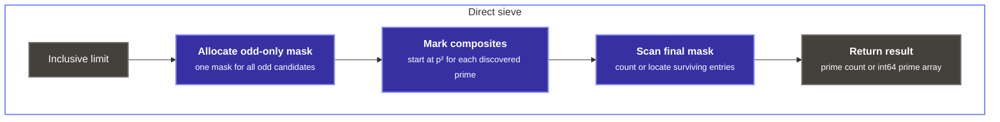
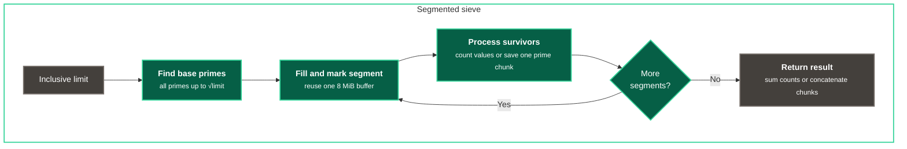

# NumPy Sieve of Eratosthenes

[](https://github.com/hypercube-xyz/numpy-sieve-of-eratosthenes/actions/workflows/tests.yml)

This repository provides an educational comparison of three odd-only
implementations of the Sieve of Eratosthenes: a Python-list baseline with
explicit loops, a direct NumPy implementation, and a segmented NumPy
implementation with a reusable marking buffer.

## Quick start

```bash
python -m pip install -r requirements.txt
```

```python
from eratosthenes import count_primes, eratosthenes
from segmented import count_primes as count_primes_segmented

print(eratosthenes(30))
# [ 2  3  5  7 11 13 17 19 23 29]

print(count_primes(1_000_000))
# 78498

print(count_primes_segmented(1_000_000))
# 78498
```

The limit is inclusive: `eratosthenes(30)` considers every integer from `0`
through `30`.

## Repository layout

| File | Purpose |
| :--- | :--- |
| `eratosthenes.py` | Direct, odd-only NumPy sieve; returns primes or a count |
| `segmented.py` | Uses direct base primes, then marks one reusable segment at a time |
| `benchmark.py` | Python-list baseline and a median execution-time CLI |
| `test_eratosthenes.py` | Reference comparisons, boundaries, contracts, and regression checks |

The baseline uses the same odd-only representation as the direct NumPy sieve.
This keeps the comparison focused on explicit Python loops versus NumPy array
operations.

## Requirements

- CPython 3.12 or later; CI currently tests 3.12 through 3.14
- NumPy 2.5.1 or later

Run commands from the cloned repository root:

```bash
python -m pip install -r requirements.txt
python -m unittest -v
```

The examples use `python` consistently so installation, tests, and benchmarks
run with the same interpreter. On Windows, `py -3` may be used in place of
every `python` command.

## Interface

Both modules expose the same small interface for examples, tests, and
benchmarks. The modules are imported directly from the repository root and do
not provide a packaged or versioned library interface.

`eratosthenes(limit)` returns a one-dimensional NumPy `int64` array, while
`count_primes(limit)` returns a Python `int` without building the final prime
array. Import the functions from the implementation you want to run.

`limit` must be a non-negative Python or NumPy integer. Boolean and non-integer
values raise `TypeError`. Negative values and values beyond the platform index
range raise `ValueError`. A valid but impractically large request may still
raise `MemoryError`.

## Implementation design

### Sieve bounds

For each discovered prime `p`, the sieve marks multiples of `p` as composite. It
only needs possible factors through `sqrt(limit)`, and marking can begin at
`p²` because smaller multiples were already handled by smaller prime factors.

### Odd-only representation

Every even integer greater than `2` is composite, so the implementations omit
those values. The direct sieve reserves mask index `0` for `2` and maps the
remaining indices to odd integers:

| Mask index | 0 | 1 | 2 | 3 | 4 | 5 |
| ---: | ---: | ---: | ---: | ---: | ---: | ---: |
| Represents | `2` | `3` | `5` | `7` | `9` | `11` |

For direct-mask indices `i >= 1`:

```text
value = 2 * i + 1
```

This reduces the mask to approximately half the number of entries required by
a representation that stores every integer.

### Vectorized composite marking

The Python baseline marks each composite through an explicit loop:

```python
for index in range(p * p // 2, len(mask), p):
    mask[index] = False
```

The direct NumPy sieve describes the same positions with one slice assignment:

```python
mask[p * p // 2 :: p] = False
```

The slice describes a strided region of the homogeneous buffer instead of
building a Python list of selected indices. A stride of `p` mask entries
corresponds to a difference of `2p` in the odd integer sequence. NumPy performs
the selected writes in native code without returning to a Python loop for each
element.

### Segmented marking

The direct sieve allocates one mask for the entire range. The segmented version
first uses the direct sieve to find base primes through `sqrt(limit)`, then
processes at most `8,388,608` odd candidates at a time. A NumPy boolean occupies
one byte, so a full segment mask has an 8 MiB payload.

For a segment beginning at the odd value `low`, mask index `i` represents:

```text
value = low + 2 * i
```

For every odd base prime `p`, an initial multiple is calculated as:

```text
square         = p * p
first_multiple = low + ((-low) % p)
start          = max(square, first_multiple)
```

If `start` is even, adding `p` moves it to the next odd multiple. The resulting
odd `start` is the first value marked in the segment:

```python
start_index = (start - low) // 2
mask[start_index::p] = False
```

The same buffer is filled with `True` and reused for the next segment. This
keeps the marking-mask payload bounded and can improve memory locality at large
limits. It does not bound the memory needed to return every prime.

Direct sieve diagram:



Segmented sieve diagram:



### Result construction

`np.count_nonzero(mask)` counts primes without allocating their final values.
`np.flatnonzero(mask)` returns the surviving indices, which are converted in
place to `int64` prime values:

```text
direct:    prime = 2 * index + 1
segmented: prime = low + 2 * index
```

The direct sieve replaces its reserved first value with `2`. The segmented
sieve handles `2` separately and concatenates its saved prime chunks once.

## Performance characteristics

NumPy does not improve the sieve's mathematical complexity. It helps here
because the workload repeatedly updates regular positions in a homogeneous
array:

- one slice assignment replaces many Python loop iterations
- the odd-only mask performs fewer writes and scans
- each NumPy boolean occupies one byte in the array buffer
- `flatnonzero()` and `count_nonzero()` perform their scans in NumPy code

A Python list stores references to shared `True` and `False` objects. On a
64-bit CPython build, each list slot is normally an 8-byte pointer, while the
NumPy mask stores each boolean value directly in one byte. This explains the
approximately eightfold mask-payload difference reported by the benchmark.

An `ndarray` also contains metadata such as its dtype, shape, strides, and data
pointer. The benchmark reports selected payload estimates rather than total
process memory, so allocator state, Python objects, NumPy metadata, and temporary
arrays are not fully represented by those columns.

For very small inputs, NumPy setup costs can outweigh the work saved. The
performance difference is an empirical result for this workload, not a general
rule that NumPy is faster than Python for every program.

## Complexity and memory

Let `n` be the inclusive limit, `B` the number of odd candidates in one
segment, `S` the number of segments, and `π(n)` the number of primes no greater
than `n`.

- Direct sieve marking is `O(n log log n)` and its mask payload is about
  `n / 2` bytes.
- Segmented composite marking performs the same sieve writes. This particular
  implementation also scans the relevant base-prime list once per segment,
  adding up to roughly `O(S · π(sqrt(n)))` Python-level checks.
- The segmented marking buffer is `O(B)` and is reused. The direct sieve and
  base-prime list through `sqrt(n)` add setup memory.
- Returning every prime requires an `int64` output of `8 · π(n)` bytes in both
  NumPy implementations. The segmented `find` operation also retains chunks
  before the final concatenation.
- `count_primes()` avoids the final prime array, so segmentation has its clearest
  memory benefit for count-only workloads.

At `100,000,000`, the direct mask payload is about `47.68 MiB`; the reusable
segment mask is `8 MiB`. The `5,761,455` returned `int64` primes require about
`43.96 MiB` regardless of which NumPy marking strategy found them.

## Benchmark

Run the default NumPy comparison:

```bash
python benchmark.py
```

Choose limits, implementations, operations, and the number of executions:

```bash
python benchmark.py 1000000 10000000 --algorithm all --repeats 7
python benchmark.py 100000000 --algorithm segmented --operation count --repeats 7
```

Algorithms:

- `python`: odd-only Python-list baseline with explicit loops
- `direct`: direct NumPy sieve
- `segmented`: segmented NumPy sieve
- `numpy`: both NumPy implementations; this is the default
- `all`: every implementation

Operations:

- `find`: return every prime
- `count`: return only the count
- `both`: benchmark both; this is the default

### Measurement methodology

For each successful case, the benchmark executes the selected function exactly
`repeats` times and reports the median execution time. `--repeats 1` therefore
performs one execution.

Timing begins immediately before the function call and stops when it returns.
Each execution includes mask allocation or reset and includes result creation
for `find` or the final boolean count for `count`. Result-size calculation and
result disposal happen after the timer stops.

`Mask storage MiB` is representation-specific: the Python estimate includes the
list header and pointer slots, while NumPy values include only array-buffer
bytes. `Result MiB` reports the NumPy array payload or an approximate Python
list-plus-integers size. These figures are not peak resident memory.

Timings depend on the CPU, cache, RAM, NumPy build, operating-system load,
thermal state, and power settings. Differences of only a few percent should be
treated as inconclusive and rerun rather than interpreted as a stable winner.

### Benchmark results

Benchmarks were run while no other project tasks were active:

```bash
python benchmark.py 1000000 10000000 100000000 --algorithm all --repeats 7
python benchmark.py 1000000000 --algorithm numpy --repeats 7
```

Test machine:

- AMD Ryzen 5 7500F
- 32 GiB RAM (2 x 16 GiB DDR5-6000)
- 64-bit Windows
- CPython 3.14.6
- NumPy 2.5.1

Each duration is the median of seven executions.

| Limit | Implementation | Find time | Count time | Mask storage | Find result |
| ---: | :--- | ---: | ---: | ---: | ---: |
| 1,000,000 | Python baseline | 0.0237029 s | 0.0135155 s | 3.81 MiB | 2.70 MiB |
| 1,000,000 | NumPy direct | 0.00066 s | 0.0003883 s | 0.48 MiB | 0.60 MiB |
| 1,000,000 | NumPy segmented | 0.000982 s | 0.0004132 s | 0.48 MiB | 0.60 MiB |
| 10,000,000 | Python baseline | 0.244274 s | 0.147555 s | 38.15 MiB | 22.82 MiB |
| 10,000,000 | NumPy direct | 0.0067137 s | 0.0045735 s | 4.77 MiB | 5.07 MiB |
| 10,000,000 | NumPy segmented | 0.0072583 s | 0.004659 s | 4.77 MiB | 5.07 MiB |
| 100,000,000 | Python baseline | 2.45734 s | 1.56643 s | 381.47 MiB | 197.80 MiB |
| 100,000,000 | NumPy direct | 0.132943 s | 0.108694 s | 47.68 MiB | 43.96 MiB |
| 100,000,000 | NumPy segmented | 0.0727138 s | 0.0428918 s | 8.00 MiB | 43.96 MiB |
| 1,000,000,000 | NumPy direct | 2.46495 s | 2.2268 s | 476.84 MiB | 387.94 MiB |
| 1,000,000,000 | NumPy segmented | 0.928623 s | 0.503757 s | 8.00 MiB | 387.94 MiB |

### Results analysis

- Direct NumPy was substantially faster than the Python-loop baseline wherever
  both were measured.
- Segmentation was not consistently faster at small limits, but was faster at
  100 million and one billion on this machine while keeping its segment mask at
  8 MiB. Different hardware or system load can move the crossover point.
- Segmented `count` avoids both a large marking mask and the final prime array.
  `find` must still return every prime; at one billion that result is much larger
  than the segment mask.

## Validation

The suite:

- compares all three implementations with an independent trial-division
  reference for every limit from `0` through `500`
- forces small segments to exercise many segment boundaries
- checks reuse of the segment-mask buffer
- checks the known prime count at one million
- verifies output shape, dtype, and Python return types
- tests Python and NumPy integer validation
- checks exact benchmark repeat counts and non-zero status on failure

GitHub Actions runs the suite on CPython 3.12, 3.13, and 3.14. The 3.12 job
tests the declared NumPy minimum, while the newer Python jobs install from
`requirements.txt`.

## Scope and limitations

- It is not suitable for generating cryptographic primes.
- The fixed segment size is a deliberate, reproducible choice rather than a
  machine-specific auto-tuning rule.
- Very large valid limits can still exhaust memory, especially when returning
  all primes.

## Technical references

Official documentation for the platform features discussed above:

- [NumPy `ndarray` documentation](https://numpy.org/doc/stable/reference/arrays.ndarray.html)
- [NumPy indexing documentation](https://numpy.org/doc/stable/user/basics.indexing.html)
- [Python `perf_counter()` documentation](https://docs.python.org/3/library/time.html#time.perf_counter)

## License

Licensed under the [MIT License](LICENSE).
