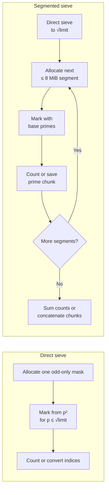

# NumPy Sieve of Eratosthenes

[](https://github.com/hypercube-xyz/numpy-sieve-of-eratosthenes/actions/workflows/tests.yml)

An educational implementation of the Sieve of Eratosthenes that explores why
NumPy can make array-heavy Python code much faster without changing the
algorithm's asymptotic complexity.

The repository keeps two implementations:

- `eratosthenes.py`: the short, direct odd-only sieve
- `segmented.py`: the cache-friendlier segmented sieve

Both omit even candidates greater than `2` and mark composites with NumPy slice
assignments. The direct sieve reserves one mask slot for `2`; the segmented
sieve handles it separately.

`benchmark.py` also includes a pure-Python version of the same odd-only
algorithm as an empirical baseline.

This project focuses on learning array processing, memory representation, and
Python performance with NumPy.

## Requirements

- Python 3.12+
- NumPy 2.5.1+

```bash
python -m pip install -r requirements.txt
```

On Windows with multiple Python versions installed, run:

```bash
py -3 -m pip install -r requirements.txt
```

## Quick start

```python
from eratosthenes import eratosthenes
from segmented import count_primes as count_primes_segmented

print(eratosthenes(30))
# [ 2  3  5  7 11 13 17 19 23 29]

print(count_primes_segmented(1_000_000))
# 78498
```

The limit is inclusive. `eratosthenes(30)` checks values from `0` through `30`.

## API

### Direct sieve: `eratosthenes.py`

#### `eratosthenes(limit)`

Returns every prime up to `limit` as a one-dimensional NumPy `int64` array.

```python
eratosthenes(10)
# array([2, 3, 5, 7])
```

#### `count_primes(limit)`

Returns the number of primes without building the final prime array.

```python
count_primes(10)
# 4
```

### Segmented sieve: `segmented.py`

The segmented module exposes the same two function names:

```python
from segmented import count_primes, eratosthenes
```

It trades a little setup overhead for a fixed-size working mask and better
cache locality at large limits.

`limit` must be a non-negative Python or NumPy integer. Invalid types raise
`TypeError`. Negative values and values beyond the platform index range raise
`ValueError`. A valid but impractically large limit may still raise
`MemoryError`.

## How the sieves work

### Shared idea: omit even candidates

Every even number greater than `2` is composite, so neither implementation
stores it. The direct sieve reserves index `0` for `2`, then stores the odd
candidates:

| Mask index | 0 | 1 | 2 | 3 | 4 | 5 |
| ---: | ---: | ---: | ---: | ---: | ---: | ---: |
| Represents | `2` | `3` | `5` | `7` | `9` | `11` |

The two index mappings are:

```text
direct mask, i >= 1:  value = 2 * i + 1
segment mask, i >= 0: value = low + 2 * i
```

Both representations use approximately half as many mask entries as a full
boolean sieve.

### Direct sieve

Only possible prime factors up to `sqrt(limit)` need to be processed. For each
prime `p`, the direct sieve marks one slice:

```python
mask[p * p // 2 :: p] = False
```

The slice starts at `p²` because smaller multiples were already handled by
smaller primes. Its stride is `p` mask slots, which corresponds to `2p` in the
integer sequence. Python chooses the slice; NumPy performs the repeated writes.

### Segmented sieve

The segmented sieve first calls the direct sieve for the base primes up to
`sqrt(limit)`. It then processes `8,388,608` odd candidates (8 MiB) at a time.
For every base prime `p`, `(-low) % p` is the distance from `low` to the next
multiple of `p`. The first odd multiple inside the segment is then:

```text
square         = p * p
first_multiple = low + ((-low) % p)
start          = max(square, first_multiple)
start_index    = (start - low) // 2
```

If `start` is even, adding `p` moves it to the next odd multiple. Marking then
uses the same compact slice operation:

```python
mask[start_index::p] = False
```

The module always uses segmentation. Callers choose the direct or segmented
module explicitly; there is no machine-dependent crossover threshold.



### Produce the answer

`np.count_nonzero(mask)` counts primes without allocating a result array.
`np.flatnonzero(mask)` returns their indices in compiled NumPy code. Those
indices are converted in place:

```text
direct:    prime = 2 * index + 1
segmented: prime = low + 2 * index
```

The direct sieve replaces its reserved first value with `2`. The segmented
sieve handles `2` separately and concatenates its prime chunks once. On 64-bit
platforms, `flatnonzero()` already returns 64-bit indices, so the conversion to
`int64` can usually reuse the existing allocation.

## Why is it fast?

NumPy does not change the Sieve of Eratosthenes from `O(n log log n)` into a
lower-complexity algorithm. The speedup comes from doing less work and making
the remaining repeated work cheaper.

| Layer | Optimization | Effect |
| --- | --- | --- |
| Algorithm | Omit evens, stop at `sqrt(n)`, start at `p²` | Fewer candidates and redundant writes |
| Python/NumPy boundary | Mark a complete arithmetic progression with one slice | Far fewer interpreter iterations |
| Data representation | Homogeneous one-byte boolean buffer | Compact storage and direct memory access |
| Result construction | Compiled scan and in-place ufuncs | No Python element loop and fewer allocations |
| Hardware | Cache and memory bandwidth | Determines throughput after interpreter overhead falls |

Some NumPy operations used here, including boolean counting and the final
integer transformations, may use SIMD. SIMD helps those steps, but most of the
speedup comes from moving repeated work out of Python and storing only odd
candidates.

### Pure-Python baseline

The benchmark baseline uses the same odd-only sieve but stores its mask in a
Python list and marks each composite in a Python loop:

```python
for index in range(p * p // 2, len(mask), p):
    mask[index] = False
```

For every composite value, the interpreter must advance the iterator, handle a
Python integer, resolve the indexed assignment, and return to the top of the
loop.

The NumPy version describes the same access pattern once:

```python
mask[p * p // 2 :: p] = False
```

Python constructs a slice descriptor and enters NumPy once. NumPy performs the
selected writes in compiled native code before returning control to Python.
The writes still happen; the optimization removes Python dispatch from each
individual write.

On a 64-bit CPython build, each list slot is an 8-byte pointer. The boolean
objects themselves are shared singletons, so the baseline does not allocate a
new Python object for every mask value. A NumPy boolean uses one byte directly
in the array buffer.

### What happens inside an `ndarray`?

A NumPy array contains a homogeneous data buffer plus metadata such as:

- `dtype`: the type and width of every element
- `shape` and `size`: the dimensions and element count
- `strides`: the byte distance used to move between elements
- a pointer to the data buffer

Because every mask element has the same fixed-width boolean type, NumPy does
not need Python's dynamic object machinery for every stored value.

A basic slice can be represented by a start offset, element count, and stride.
It does not require a Python list containing every selected index. A simplified
model is:

```text
address = data + start_offset

repeat for each selected element:
    write False at address
    address += stride_in_bytes
```

This simplified model shows the repeated address calculation and write running
in a native loop over a typed buffer.

### Why the smaller mask matters

Omitting even candidates reduces more than the allocation size:

- roughly half as many mask values are initialized
- fewer composite positions are written
- `flatnonzero()` and `count_nonzero()` scan fewer bytes
- more active data can fit in CPU caches
- less data moves between caches and RAM

Composite marking performs little arithmetic. For large limits it is largely a
memory-access workload. Small primes create dense writes; larger primes create
sparser strided writes. Without segmentation, cache misses, memory latency, and
memory bandwidth increasingly dominate as the mask grows.

## Time and memory

### Complexity

- Time: `O(n log log n)`
- Pure-Python working mask: approximately `(n / 2) * pointer size`
- Direct working mask: approximately `n / 2` bytes
- Segmented working memory: up to an 8 MiB mask plus a direct sieve to `sqrt(n)`
- Returned prime array: 8 bytes per prime

A NumPy boolean occupies one byte in this mask. At `100,000,000`, the segmented
working mask is 8 MiB. The 5,761,455 returned `int64` primes occupy about
`43.96 MiB`.

Array sizes are not the same as peak process memory. Python, NumPy metadata,
the memory allocator, base primes, result chunks, and concatenation add
overhead. Both `count_primes()` implementations avoid the final result array.

## Benchmark

Run the defaults:

```bash
python benchmark.py
```

Choose limits, algorithm, operation, and repeat count:

```bash
python benchmark.py 1000000 10000000 --algorithm all --repeats 10
python benchmark.py 100000000 --algorithm segmented --operation count --repeats 10
```

Algorithms:

- `python`: benchmark the pure-Python baseline
- `direct`: benchmark `eratosthenes.py`
- `segmented`: benchmark `segmented.py`
- `numpy`: benchmark both NumPy implementations; this is the default
- `all`: benchmark every implementation

Operations:

- `find`: build and return the prime array
- `count`: count primes without returning the array
- `both`: benchmark both; this is the default

Each case gets one untimed warm-up. The reported duration is the median of the
timed runs. Every run includes mask allocation. `find` also includes result
construction, while `count` includes the final boolean count. Python mask sizes
include the list header and pointer slots; shared boolean singletons are not
counted repeatedly. Python result sizes include the list, its pointers, and
referenced integer objects. NumPy sizes report array payloads. These figures
are not peak resident memory.

### Sample result

The following results were measured over 10 runs on:

- AMD Ryzen 5 7500F
- Python 3.14.6
- NumPy 2.5.1

| Limit | Algorithm | Find primes | Count only | Mask | Result |
| ---: | :--- | ---: | ---: | ---: | ---: |
| 1,000,000 | Pure Python | 0.023679 s | 0.013144 s | 3.81 MiB | 2.70 MiB |
| 1,000,000 | NumPy Direct | 0.000644 s | 0.000388 s | 0.48 MiB | 0.60 MiB |
| 1,000,000 | NumPy Segmented | 0.000803 s | 0.000317 s | 0.48 MiB | 0.60 MiB |
| 10,000,000 | Pure Python | 0.239802 s | 0.144357 s | 38.15 MiB | 22.82 MiB |
| 10,000,000 | NumPy Direct | 0.006706 s | 0.004095 s | 4.77 MiB | 5.07 MiB |
| 10,000,000 | NumPy Segmented | 0.007061 s | 0.004064 s | 4.77 MiB | 5.07 MiB |
| 100,000,000 | Pure Python | 2.416512 s | 1.530187 s | 381.47 MiB | 197.80 MiB |
| 100,000,000 | NumPy Direct | 0.146733 s | 0.122938 s | 47.68 MiB | 43.96 MiB |
| 100,000,000 | NumPy Segmented | 0.117301 s | 0.056383 s | 8.00 MiB | 43.96 MiB |
| 1,000,000,000 | NumPy Direct | 2.437213 s | 2.197343 s | 476.84 MiB | 387.94 MiB |
| 1,000,000,000 | NumPy Segmented | 1.845142 s | 0.534450 s | 8.00 MiB | 387.94 MiB |

Relative impact is easier to see as a ratio:

| Change | Limit | Find speed | Count speed | Mask reduction |
| :--- | ---: | ---: | ---: | ---: |
| Pure Python → NumPy Direct | 1,000,000 | 36.77× | 33.88× | 8.00× |
| Pure Python → NumPy Direct | 10,000,000 | 35.76× | 35.25× | 8.00× |
| Pure Python → NumPy Direct | 100,000,000 | 16.47× | 12.45× | 8.00× |
| NumPy Direct → NumPy Segmented | 10,000,000 | 0.95× | 1.01× | 1.00× |
| NumPy Direct → NumPy Segmented | 100,000,000 | 1.25× | 2.18× | 5.96× |
| NumPy Direct → NumPy Segmented | 1,000,000,000 | 1.32× | 4.11× | 59.60× |

Values above `1×` mean the algorithm to the right of the arrow is faster or
uses a smaller mask; values below `1×` mean it is slower.

Timings vary between runs. Results depend on CPU cache, RAM, NumPy build,
operating-system load, and power settings. The direct sieve wins slightly at
small limits; the segmented sieve wins once memory traffic dominates. The
Python baseline is omitted at one billion because its cost is already clear.

## Tests

```bash
python -m unittest -v
```

The suite compares the Python baseline and both NumPy implementations with an
independent reference for every limit from `0` through `500`, exercises many
small segment boundaries, checks the known prime count at one million, verifies
the result contract, and tests Python/NumPy integer validation.

GitHub Actions runs the same tests on Python 3.12, 3.13, and 3.14.

## References

- [NumPy `ndarray` documentation](https://numpy.org/doc/stable/reference/arrays.ndarray.html)

## License

Licensed under the [MIT License](LICENSE).
